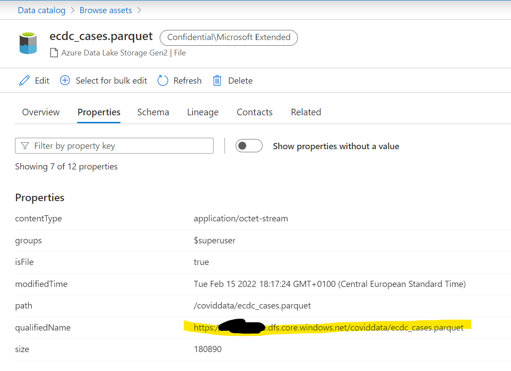
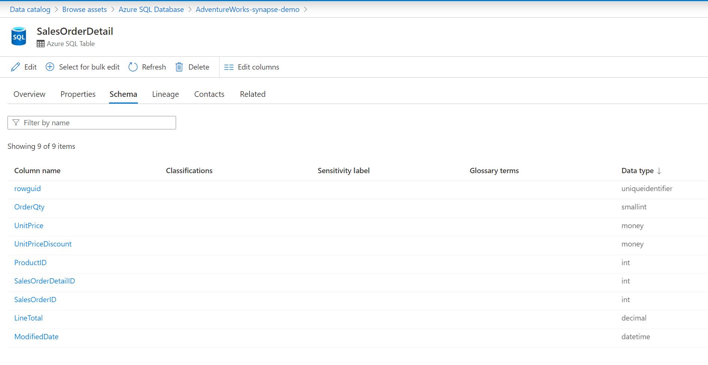

# Streamline Data Virtualization for SQL with Purview

This sample aims to show how metadata that is gathered by Microsoft Purview when scanning a data source can be leveraged to streamline the creation of External Tables in SQL Databases.

## Features

This sample includes:

* Code to automate the creation of External Tables in Azure SQL Database (relies on preview feature [Elastic Query](https://learn.microsoft.com/azure/azure-sql/database/elastic-query-overview?view=azuresql))
* Code to automate the creation of External Tables in Azure Synapse Analytics SQL Pools (works with Dedicated Pools as well as Serverless Pools)

## Getting Started

### Prerequisites

* .NET 6.0 or later
* VSCode or Visual Studio
* Microsoft Purview Account
* For Scenario 1: External Table from storage:
  * Azure Storage Account configured as Data Lake Storage Gen2 containing at least a parquet dataset
  * Synapse Analytics workspace
* For Scenario 2: External Table from SQL:
  * 2 Azure SQL Databases **under the same logical server**. One of the databases, the source database, will have to contain at least 1 table.

### Installation

Clone repository and open with VSCode or Visual Studio. Build the solution.

## How It Works

### Common to all scenarios

Register and then scan your data source (see prerequisites above for supported data sources) with Microsoft Purview. For detailed instructions see [Microsoft Purview: Scan and Ingestion](https://learn.microsoft.com/azure/purview/concept-scans-and-ingestion).

The solution calls Microsoft Purview's Data Catalog APIs using a Service Principal.

**1. Authorize Service Principal to make calls to Purview Data Plane REST APIs.**

* Create a Service Principal, for details follow [these steps](https://learn.microsoft.com/azure/active-directory/develop/howto-create-service-principal-portal) 
* In Purview Studio
  * Select the Data Map in the left menu.
  * Select Collections
  * Select the root collection or the collection where your dataset resides.
  * Select the Role assignments tab.
  * Assign the 'Data Curator' role to the SP created above to access various data planes in Azure Purview:

### Specific steps for Scenario 1: External Table from storage

**2. Authorize Azure Synapse MSI to access your ADLS Gen 2 Storage account.**

- Navigate to your Azure Synapse Account in the Azure Portal
  - Copy the name of your Synapse Workspace (this is the name of your MSI)
- Locate now your ADLS Gen 2 Storage Account in the Azure Portal and navigate to the IAM option
  - Give your MSI (from previous step) **Storage Blob Data Reader** rights under the Role Assignments

**(Optional) 3. Prepare Synapse Workspace with necessary definitions.**
> Note: this step is not required as the below SQL scripts are included in the code and therefore will be executed automatically if you have not already defined the below.

- (Optional) Create EXTERNAL FILE FORMAT and EXTERNAL DATA SOURCE DEFINITIONS
In SSMS, Azure Data Studio, or the portal Navigate to Develop and create and execute the below SQL Script.

```sql
CREATE SCHEMA <your_schema_name>;

CREATE EXTERNAL FILE FORMAT parquet WITH (  FORMAT_TYPE = PARQUET );
GO

CREATE DATABASE SCOPED CREDENTIAL WorkspaceIdentity
WITH IDENTITY = 'Managed Identity';
GO

CREATE EXTERNAL DATA SOURCE <your_data_source_name> 
WITH (
    LOCATION = 'abfss://<your-container>@<your-adls-stg-account>.dfs.core.windows.net',
    CREDENTIAL = WorkspaceIdentity
);
GO
```

**4. Create a Serverless pool or a Dedicated pool - take note of the name to use on the next step.**

**5. Navigate to your dataset asset in Purview and retrieve the Fully Qualified Name of the asset.**

Make sure you have the information available in Properties and Schema tabs:


**6. Configure the `appsettings.json` file.**

Under the `src` folder in this repo you will find a `template.appsettings.json` file. Rename it to `appsettings.json` and configure it accordingly

- the Database settings refer to your Serverless/Dedicated Synapse pool settings and the Purview settings refer to your Purview account.
- fill the Destination Settings as desired

```json
{
    "DatabaseSettings": {
        "DataSource" : "<your-server>.database.windows.net",
        "UserID" :"<your-sql-user>",
        "Password":"<your-password>" ,
        "InitialCatalog": "<your-db-name>"
    },
    "PurviewSettings": {
        "TenantId":"<your-purview-service-tenant-id>",
        "ApplicationId": "<your-authorized-application-id>",
        "AuthenticationKey": "<your-authentication-key>",
        "PurviewUri": "<your-purview-uri>",
        "PurviewFilePathQualifiedName": "<your-purview-file-path-qualified-name>",
        "PurviewSQLTableQualifiedName": ""
    },
    "DestinationSettings": {
        "ExternalTableName": "<name-of-your-external-table>",
        "ExternalDataSrcName": "<name-of-your-external-data-source>",
        "ExternalSchemaName": "<name-of-your-external-schema>" 
    }
}
```

**7. Run the code and Verify results**

- Build and execute your code
- Navigate to your Synapse workspace and verify the external table has been correctly created in your database.
- Query the newly created external table

### Specific steps for Scenario 2: External Table from SQL

**2. Set proper authorizations in the source Azure SQL Database.**
- Authorize Azure Purview MSI to access the **source** Azure SQL Database: make Purview's MSI a `db_datareader`. Replace `<PurviewMSI>` with the name of your Purview account.

```sql
CREATE USER [<PurviewMSI>] FROM EXTERNAL PROVIDER
GO

EXEC sp_addrolemember 'db_datareader', [<PurviewMSI>]
GO
```

**3. Create the needed credentials in both source and destination Azure SQL Databases.**

- In the destination SQL DB, run the following T-SQL statements:

```sql
CREATE MASTER KEY ENCRYPTION BY PASSWORD = '<strong-password>'
GO

IF NOT EXISTS (SELECT * FROM sys.database_scoped_credentials WHERE name = '<name-of-your-external-table>Cred') 
  CREATE DATABASE SCOPED CREDENTIAL [<name-of-your-external-data-source>Cred]
    WITH IDENTITY = '<sqluser>',
    SECRET = '<password>';
GO
```

> Note: We assume that the name of the credential to access the source SQL Database will follow this pattern: `<name-of-your-external-data-source>Cred`. In your `appsettings.json` file you will have to specify such External Data Source name. If the external source does not already exist in the **destination** database we will create it using `<name-of-your-external-data-source>Cred` as a credential, for this reason this step is required.

- Make sure the `<sqluser>` exists in the source SQL Database and has `db_datareader` rights in the source database. You can run the following statement in the **source** SQL Database:

```sql
EXEC sp_addrolemember 'db_datareader', '<sqluser>'
GO
```

**4. Register and Scan the SQL Database in Purview, so the source table's metadata is captured by Purview.**

Make sure you have the information available in Properties and Schema tabs, make note of the Fully Qualified name of the asset:


**6. Configure the `appsettings.json` file.**

Under the `src` folder in this repo you will find a `template.appsettings.json` file. Rename it to `appsettings.json` and configure it accordingly

- the Database settings refer to your SQL Database logical server connection settings. We assume source and destination databases are in the same logical server.
- the Purview settings refer to your Purview account, the `TenantId` is your AAD tenant id.
- fill the Destination Settings as desired

```json
{
    "DatabaseSettings": {
        "DataSource" : "<your-server>.database.windows.net",
        "UserID" :"<your-sql-user>",
        "Password":"<your-password>" ,
        "InitialCatalog": "<your-db-name>"
    },
    "PurviewSettings": {
        "TenantId":"<your-purview-service-tenant-id>",
        "ApplicationId": "<your-authorized-application-id>",
        "AuthenticationKey": "<your-authentication-key>",
        "PurviewUri": "<your-purview-uri>",
        "PurviewFilePathQualifiedName": "",
        "PurviewSQLTableQualifiedName": "<your-purview-sql-table-qualified-name>"
    },
    "DestinationSettings": {
        "ExternalTableName": "<name-of-your-external-table>",
        "ExternalDataSrcName": "<name-of-your-external-data-source>",
        "ExternalSchemaName": "<name-of-your-external-schema>" 
    }
}
```
> Note that:
>
> The `PurviewFilePathQualified` name needs to be left empty for this scenario.
>
> The code assumes the following:
> - A credential in the source database exists with name `<name-of-your-external-data-source>Cred` (refer to step 2).
> - The table does not have column data types that are not supported such as `xml` or `geography`, the full list of unsupported column data types is available in this article [CREATE EXTERNAL TABLE (Transact-SQL)](https://learn.microsoft.com/sql/t-sql/statements/create-external-table-transact-sql?view=azuresqldb-current&preserve-view=true&tabs=dedicated#limitations-and-restrictions-1).
> - The external schema name in the destination Database is the same as the schema name in the source Database.
